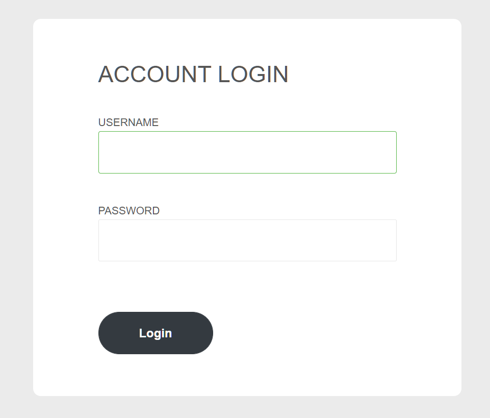
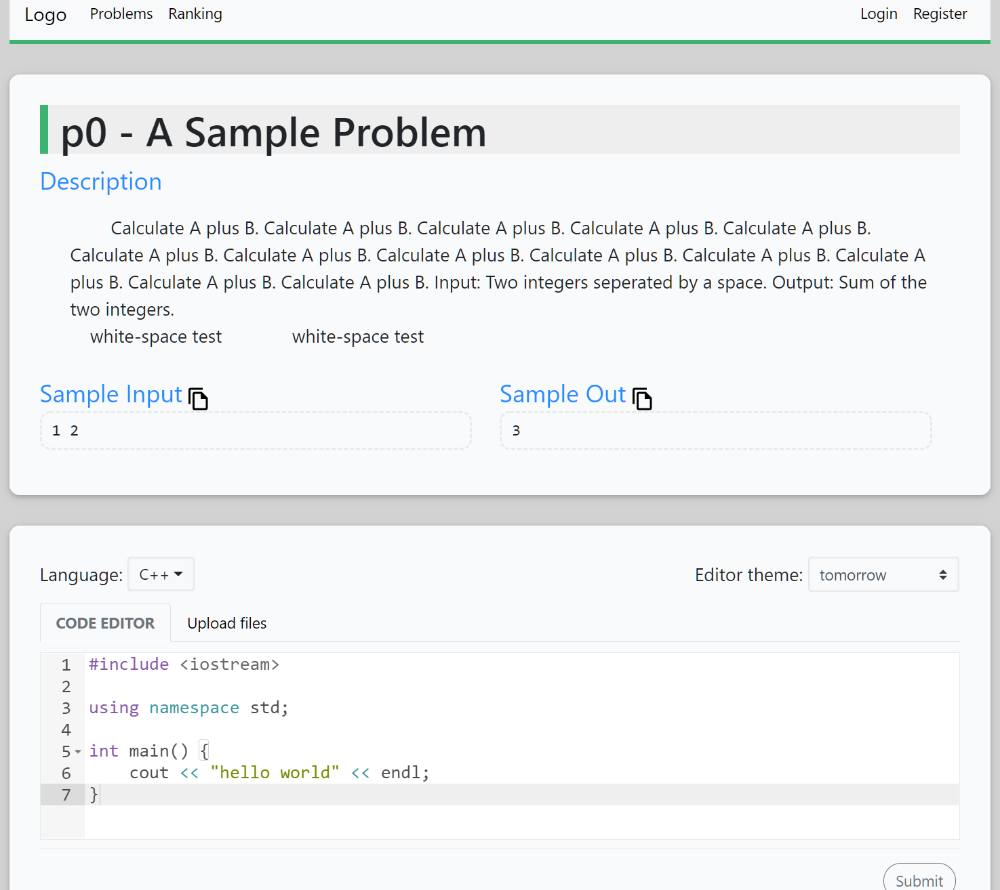

A online judge problem page.

  

  

## Features

- RWD
- one-click copy sample in/out
- multiple file uploader (main, multiple implement files, multiple header files)
- powerful code editor - [ace](https://ace.c9.io/)
  - syntax highlighting for multi-language (C++, C, Python...)
  - over 30 themes.
  - automatic indent and outdent
  - live auto completion
  - indent guides
  - code folding
  - [keyboard shortcuts](https://github.com/ajaxorg/ace/wiki/Default-Keyboard-Shortcuts)
  - additional: `F11` full screen, `Ctrl-+/=/-` font size
  - more...

## Details

Details in problemPage/README.md, loginPage/README.md.
