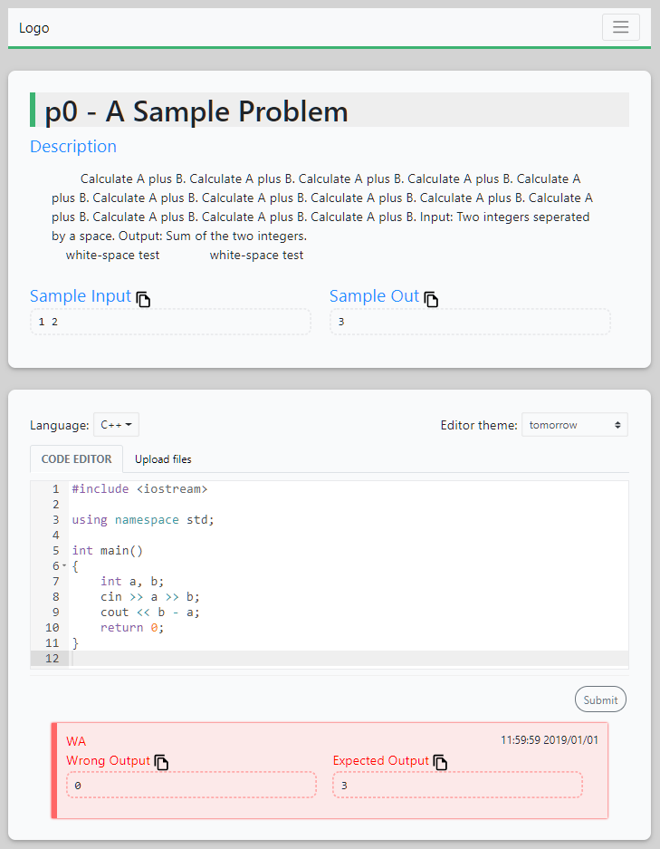

A online judge problem page.



## Features

- RWD
- one-click copy sample in/out
- multiple file uploader (main, multiple implement files, multiple header files)
- powerful code editor - [ace](https://ace.c9.io/)
  - syntax highlighting for multi-language (C++, C, Python...)
  - over 30 themes.
  - automatic indent and outdent
  - live auto completion
  - indent guides
  - code folding
  - [keyboard shortcuts](https://github.com/ajaxorg/ace/wiki/Default-Keyboard-Shortcuts)
  - additional: `F11` full screen, `Ctrl-+/=/-` font size, drag bar to adjust height
  - more...

## Used Frameworks and Tools

- [W3.CSS](https://www.w3schools.com/w3css/)
- [Bootstrap-Vue](https://bootstrap-vue.js.org/)
- [Vue](https://vuejs.org/)
- [Axios](https://github.com/axios/axios)
- [Ace](https://ace.c9.io/)
- [httpbin](https://httpbin.org/)

## Test Mode

call motheds below in browser console.

- Test.Login()
- Test.Logout()
- Test.SubmitAC()
- Test.SubmitCE()
- Test.SubmitTLE()
- Test.SubmitWA()
- Test.SubmitMLE()

#### JSON

```js
{ // request
    "action" : "submit_code",
    "qID" : "p0",
    "language" : "cpp", // "cpp"||"c"||"python"
    "fileAmount": 3,
    "file":
    {
        "file1" : "code_string..................",  //main.cpp || main.c
        "file2" : "code_string..................",
        "file3" : "code_string.................."
    },
    "headerFileAmount": 3,
    "headerFile":
    {
        "file1" : "code_string..................",  //1.h
        "file2" : "code_string..................",  //2.h
        "file3" : "code_string.................."   //3.h
    },
    "userName" : "testman",
    "Class" : "CSIE110",
    "hash" : "A7FCFC6B5269BDCCE571798D618EA219A68B96CB87A0E21080C2E758D23E4CE9"
}
```
```js
{ // response
    "codeState" : "WA", // "AC" || "CE" || "TLE" || "WA" || "MLE"
    "errorMessage" : "compile error, code: 4906. ...",
    "exeTime" : "90ms",
    "errorOutputCompare" : "",
    "OutputAvailable": "true", // "true" || "false"
    "wrongOutput" : "0",
    "expectedOutput" : "3",
    "memoryUsage" : "used 72KB",
    "verdictTime" : "11:59:59  2019/01/01",
    "userName" : "testman",
    "Class" : "CSIE110",
    "hash" : "A7FCFC6B5269BDCCE571798D618EA219A68B96CB87A0E21080C2E758D23E4CE9"
}
```
